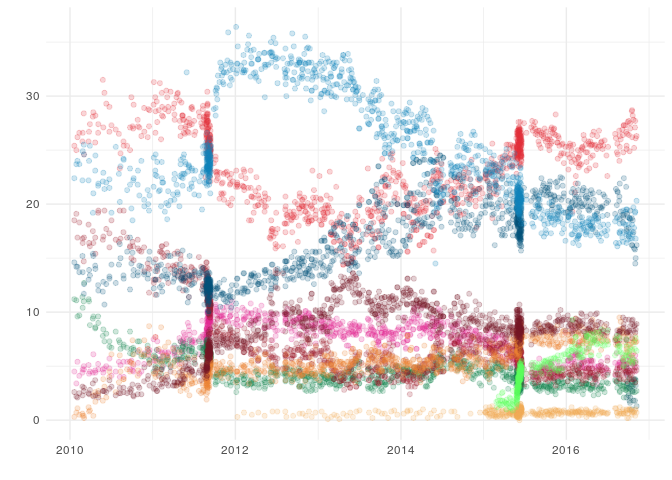
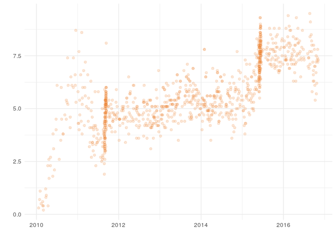

<!-- README.md is generated from README.Rmd. Please edit that file -->
pollsDK
=======

The goal of pollsDK is to make it easy to download and use danish polling data.

Installation
------------

You can install pollsDK from github with:

``` r
# install.packages("devtools")
devtools::install_github("56north/pollsDK")
```

Gahner
------

The package owes a lot to [Erik Gahner](https://github.com/erikgahner) whos github repo [polls](https://github.com/erikgahner/polls) make many of the functions in this package possible.

There are four gahner\_ functions in this package:

#### `gahner`

``` r
## Collects poll data from Erik Gahners Github

polls <- gahner()

polls
#> # A tibble: 1,007 × 18
#>       id pollingfirm  year month   day party_a party_b party_c party_d
#>    <int>       <chr> <int> <int> <int>   <dbl>   <dbl>   <dbl>   <dbl>
#> 1      1     Megafon  2010     1    20    25.4     4.5    11.2      NA
#> 2      2      Gallup  2010     1    29    25.0     3.4    11.1      NA
#> 3      3      Greens  2010     2     3    26.2     5.4     9.6      NA
#> 4      4     Rambøll  2010     2    11    26.6     4.1     9.7      NA
#> 5      5     Megafon  2010     2    25    25.8     4.4    11.4      NA
#> 6      6      Gallup  2010     2    26    26.6     4.7    10.4      NA
#> 7      7      Greens  2010     3     3    28.4     5.0    11.0      NA
#> 8      8     Rambøll  2010     3     4    24.6     4.7    12.7      NA
#> 9      9     Megafon  2010     3    24    25.8     5.1    11.2      NA
#> 10    10      Gallup  2010     3    26    26.7     4.3    11.0      NA
#> # ... with 997 more rows, and 9 more variables: party_f <dbl>,
#> #   party_i <dbl>, party_k <dbl>, party_o <dbl>, party_v <dbl>,
#> #   party_oe <dbl>, party_aa <dbl>, n <int>, source <chr>
```

#### `gahner_partyletters` and `gahner_pollingfirms`

``` r
## Tells you which parties and  which polling firms are in Gahners data

gahner_partyletters()
#>  [1] "A" "Å" "B" "C" "D" "F" "I" "K" "O" "Ø" "V"

gahner_pollingfirms()
#> [1] "Epinion"  "Gallup"   "Greens"   "Megafon"  "Norstat"  "Rambøll" 
#> [7] "Voxmeter" "Wilke"    "YouGov"
```

#### `gahner_plot`

``` r
## Visualizes poll data from Erik Gahners Github

gahner_plot()
```



You can filter the `gahner_plot()` by telling it which parties or polling firms you want to include in the plot.

``` r
## Visualizes poll data from Erik Gahners Github, but filter to only include "I" (Liberal Alliance).


gahner_plot(parties = "I")
```



Berlingske and Ritzau
---------------------

You can also pull the polls from Berlingske Barometer and Ritzau Index

#### `berlingskebarometer`

``` r
# Get information from Berlingske Barometer

berlingskebarometer()
#> # A tibble: 894 × 6
#>    letter percent mandates support uncertainty   datetime
#>     <chr>   <dbl>    <dbl>   <dbl>       <dbl>     <dttm>
#> 1       V    18.9       33       9         1.0 2016-11-06
#> 2       A    27.3       48       2         1.2 2016-11-06
#> 3       B     5.2        9       2         0.6 2016-11-06
#> 4       C     3.0        5       1         0.5 2016-11-06
#> 5       D     2.2        4       1         0.4 2016-11-06
#> 6       F     4.4        8       2         0.5 2016-11-06
#> 7       I     7.0       12       1         0.7 2016-11-06
#> 8       K     0.7        0       1         0.2 2016-11-06
#> 9       O    16.7       30       1         1.0 2016-11-06
#> 10      Ø     8.6       15       2         0.7 2016-11-06
#> # ... with 884 more rows
```

``` r
# And even from previous years

berlingskebarometer(2014)
#> # A tibble: 756 × 6
#>    letter percent mandates support uncertainty   datetime
#>     <chr>   <dbl>    <dbl>   <dbl>       <dbl>     <dttm>
#> 1       V    24.3       43       2         1.2 2014-12-27
#> 2       O    19.5       34       2         1.1 2014-12-27
#> 3       K     0.7        0       2         0.2 2014-12-27
#> 4       I     5.6       10       2         0.7 2014-12-27
#> 5       F     7.2       13       1         0.7 2014-12-27
#> 6       C     4.2        7       2         0.6 2014-12-27
#> 7       B     7.6       13       1         0.8 2014-12-27
#> 8       Ø     9.5       17       1         0.8 2014-12-27
#> 9       A    21.3       38       9         1.2 2014-12-27
#> 10      V    24.5       43       2         1.3 2014-12-21
#> # ... with 746 more rows
```

#### `ritzauindex`

Ritzau provides a list of data frame with the most recent polls from a select number of pollsters. Each one hase the pollsters number and Ritzaus own index.

``` r
# Get Ritzau data

ritzau <- ritzauindex()
#> List with data frames of polls:
#> Voxmeter 06.11
#> Greens 02.11
#> Epinion 20.10
#> Wilke 17.10
#> Norstat 09.10
#> Gallup 06.10
#> Each data frame include the Ritzau Index

ritzau[[1]]
#> # A tibble: 12 × 13
#>    PartyId Party
#> *    <int> <lgl>
#> 1        1    NA
#> 2        4    NA
#> 3        2    NA
#> 4        8    NA
#> 5       11    NA
#> 6       10    NA
#> 7        9    NA
#> 8        3    NA
#> 9        7    NA
#> 10       6    NA
#> 11       5    NA
#> 12      17    NA
#> # ... with 11 more variables: PartyName <chr>, PartyLogo <chr>,
#> #   PartyBlock <chr>, PartyColor <chr>, Percentage <dbl>, Mandate <dbl>,
#> #   RitzauPartyColor <chr>, RitzauPercentage <dbl>, RitzauMandate <dbl>,
#> #   ChartSortOrder <int>, IsOfficial <lgl>
```
